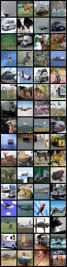
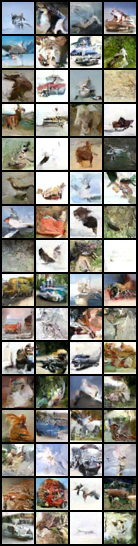
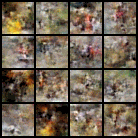

# CIFAR Image Generator (DDPM)

A modern, modular PyTorch implementation of a Denoising Diffusion Probabilistic Model (DDPM) designed for generating high-quality images (specifically CIFAR-10). This repository serves as a clean, educational, and extensible codebase for understanding and experimenting with diffusion models.

## Results

### Model Performance
Below are images generated by the model after training. The model has learned to capture the structure and color distribution of the CIFAR-10 dataset.

| Real Samples (CIFAR-10) | Generated Samples (DDPM) |
|:---:|:---:|
|  |  |

### Training Evolution
The following animation shows how the model improves its generation capabilities over 100 epochs, starting from pure noise and gradually learning to produce recognizable structures.



## Key Features

-   **Modular Design**: The codebase is split into logical components (`UNet`, `DDPM`, `Dataset`, `Config`), making it easy to read and modify.
-   **Robust Configuration**: Powered by `dataclasses`, the `Config` system allows for type-safe and centralized hyperparameter management.
-   **Reproducibility**: Integrated seed setting and automatic experiment tracking (saving configs, checkpoints, and samples).
-   **Weights & Biases (WandB)**: Optional built-in integration for experiment logging and visualization.

## Architecture

This project implements the standard DDPM formulation:
-   **Backbone**: A customized U-Net (`src/modules/unet.py`) with:
    -   Sinusoidal Time Embeddings.
    -   Residual blocks (`DoubleConv`).
    -   Downsampling/Upsampling paths with skip connections.
-   **Diffusion Process**: Managed by the `DDPM` class (`src/modules/ddpm.py`), handling:
    -   Forward diffusion (adding noise).
    -   Reverse diffusion (denoising step-by-step).
    -   Linear beta schedule.

## Installation

1.  **Clone the repository**:
    ```bash
    git clone https://github.com/Bhavikupadhyay/cifar-image-generator.git
    cd cifar-image-generator
    ```

2.  **Set up the environment**:
    ```bash
    python3 -m venv venv
    source venv/bin/activate
    pip install -r requirements.txt
    ```

## Usage

### Training

To start a training run:
```bash
python train.py
```
**Configuration**:
Modify hyperparameters in `src/config.py`. All runs are saved to the `runs/` directory with a timestamp.

### Inference / Sampling

To generate images using a trained model:
```bash
# Basic usage (defaults to latest checkpoint in the run folder)
python inference.py --run_name <RUN_TIMESTAMP_OR_NAME>

# Advanced usage
python inference.py \
    --run_name 2026-02-15_14-55-53 \
    --num_samples 64 \
    --outfile my_samples.png
```

## Project Structure

```
.
├── assets/                 # Results and training visualizations
├── src/
│   ├── modules/
│   │   ├── unet.py         # U-Net architecture
│   │   ├── ddpm.py         # Diffusion logic
│   │   └── blocks.py       # Residual blocks
│   ├── config.py           # Configuration
│   ├── dataset.py          # Data loading
│   └── utils.py            # Helpers
├── train.py                # Training entry point
├── inference.py            # Generation entry point
└── requirements.txt        # Dependencies
```
